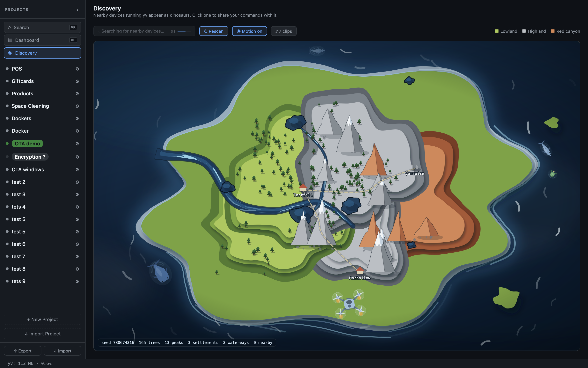
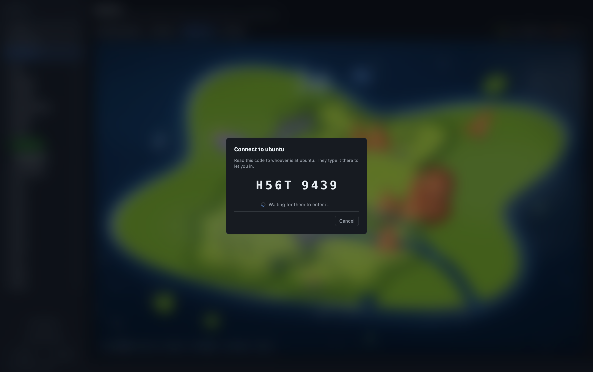
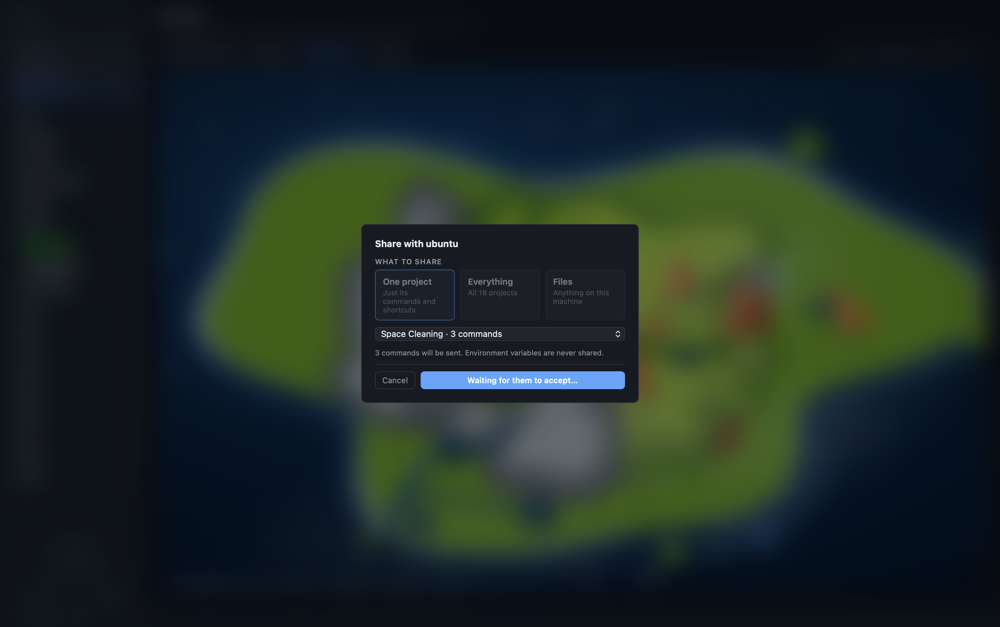
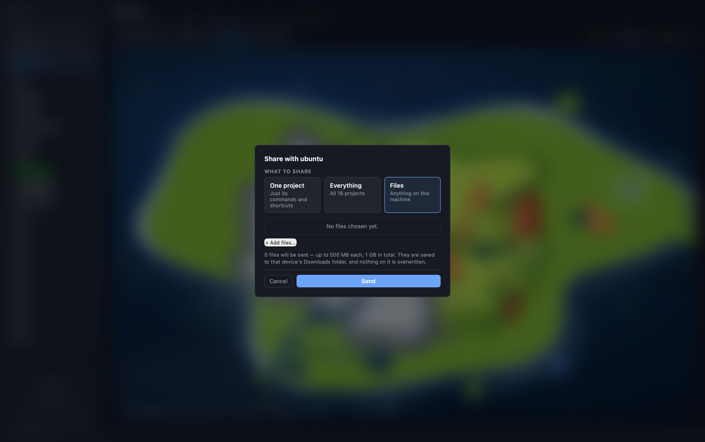
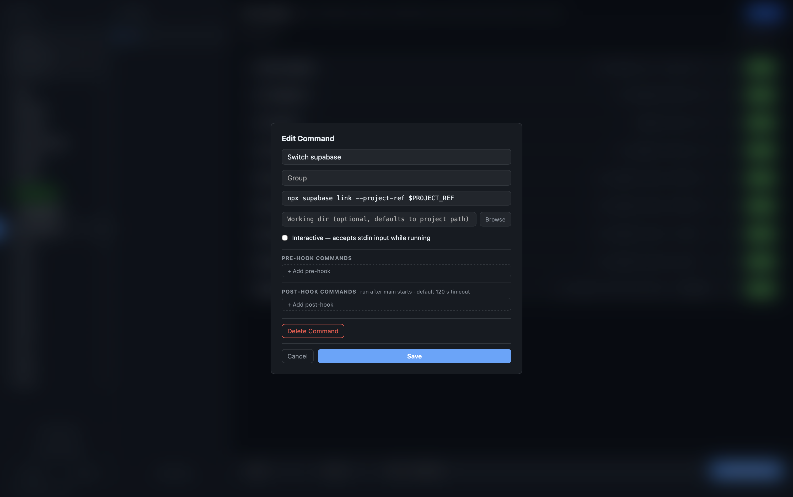
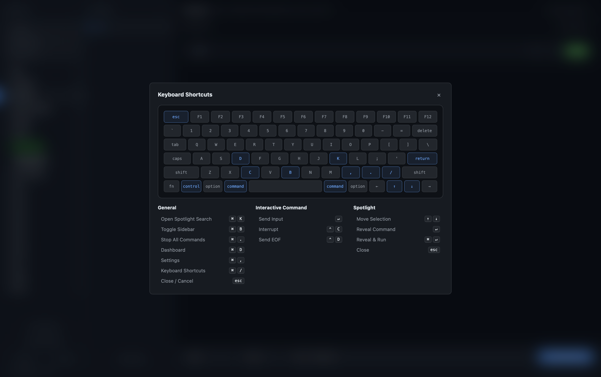
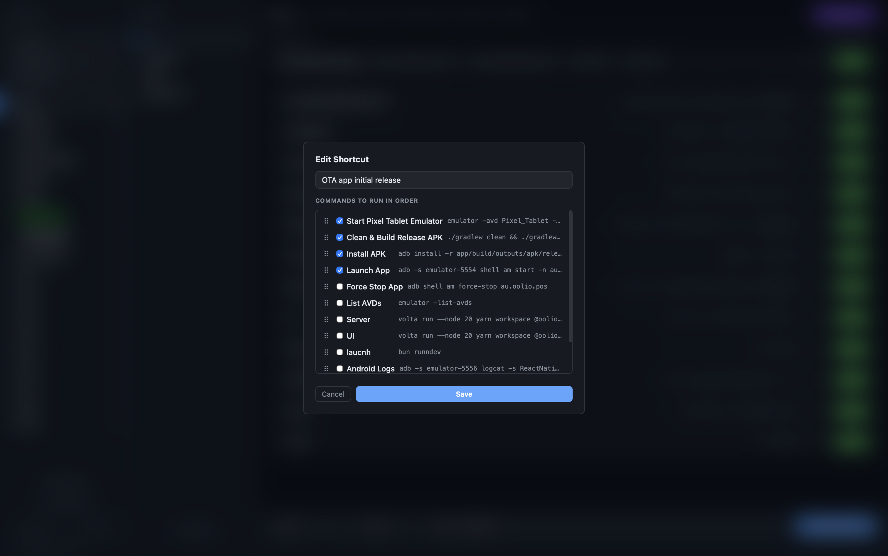
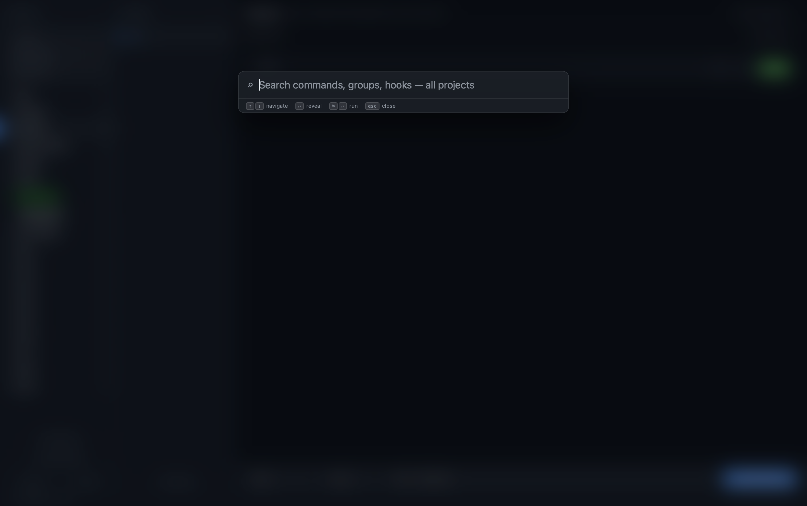
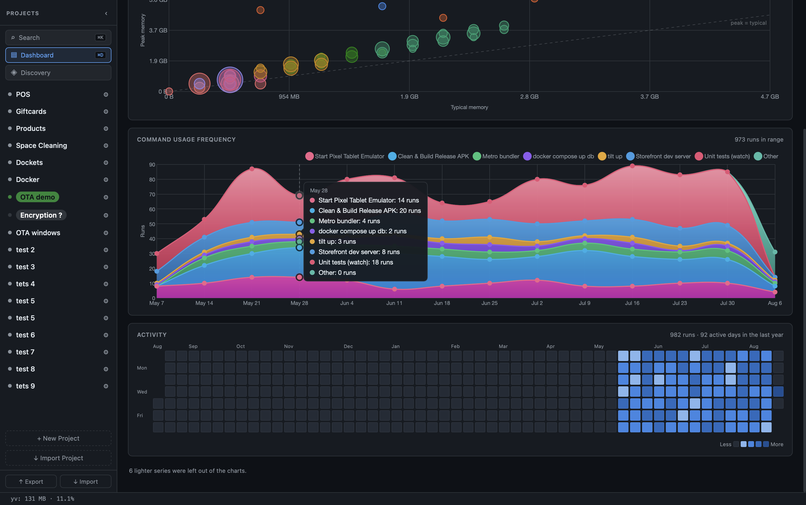
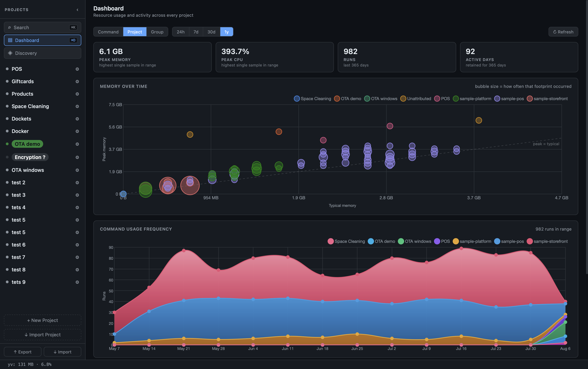

# Features

A visual tour of what yv can do.

---

## Device discovery and sharing

yv finds other yv instances on the same local network over mDNS. Nearby devices appear as dinosaurs on a procedurally generated island map, surveyed by a scanning drone.

No cloud account, no relay server — peer-to-peer on your LAN only.

### Connect by code

Tap a dinosaur to start sharing. The sending device draws an 8-character code and displays it large. You read it out; the other person types it. Only the hash ever crosses the wire — a stranger on the same Wi-Fi cannot intercept or guess the code.

Connections last 15 minutes, extended automatically while a transfer is in progress.

### Send project config

Once connected, send one project or your entire config as JSON or YAML. The other device gets a prompt and accepts it. Their commands are immediately ready to run.

### Send files

Send arbitrary files up to 500 MB each, 1 GB and 64 files per transfer. Progress is shown live on both ends. Files land in `~/Downloads/yv-received` (macOS / Linux) or the equivalent on Windows, never overwriting existing files.

---

## Projects and commands

Organise your shell commands into projects. Each project has a folder path and a list of commands. Commands are further grouped (e.g. Android, iOS, Backend) — the middle column lets you filter by group.

Click **Run** on any command. Output streams live into a collapsible inline terminal per row.

---

## Environment variables

Each project can hold named environments — `local`, `staging`, `prod`, or whatever you call them. Each environment is a set of key/value pairs injected into every command run.

Values are masked by default. Switch environments from the project header — the active one is shown with a colour you pick, so a `prod` environment is unmistakable at a glance.

Secrets live in a separate file (`environments.json`, mode 0600) and never appear in exported project config.

---

## Shortcuts — run sequences with one click

A shortcut is a named list of commands that run in order. If any step fails, the rest are skipped.

Each shortcut card shows step pills that update live: running → ok / failed / skipped. Use shortcuts to wire together build, install and launch steps into one button.

---

## Spotlight search

`⌘K` opens a global search over every command in every project. Matches on label, shell text, group, project name, and pre/post hook contents.

Keyboard navigation: `↑` / `↓` to move, `↵` to reveal the command in its project, `⌘↵` to reveal and run immediately.

---

## Dashboard

`⌘D` opens a dashboard with peak memory, peak CPU, run counts, memory over time, and an activity heatmap showing which commands you actually run.

Metrics collection is **off by default**. Turn it on in Settings if you want it.

---

## What's in a command

Each command can have:

- **Label** — the name shown in the UI
- **Group** — which column it lives in
- **Working directory** — overrides the project path (also settable per group)
- **Pre-hooks** — shell commands that run before the main command (e.g. `direnv exec .`)
- **Post-commands** — cleanup commands that run after exit, each with a timeout
- **Interactive mode** — reveals a stdin field while the command is running; Enter sends text, Ctrl+C sends interrupt, Ctrl+D sends EOF
- **Live resource badge** — CPU and memory usage updated every 3 seconds

---

## Export and import

Export any project (or all of them) as JSON or YAML. Commit it to your repo. Your teammates import it and get the same commands with the same settings — one click to run.

Environments are always excluded from exports, so a config you share carries no secrets.

---

## Keyboard shortcuts

`⌘/` opens a rendered keyboard layout showing every shortcut the app understands.

| Shortcut | Action |
|---|---|
| `⌘K` or `⌘F` | Open Spotlight search |
| `⌘D` | Open Dashboard |
| `⌘,` | Open Settings |
| `⌘/` | Show keyboard shortcuts |
| `Esc` | Close any modal or Spotlight |

---

## Settings

`⌘,` opens Settings. From there:

- **Your device name** — what nearby devices call you on the discovery map. Defaults to your hostname.
- **Metrics** — toggle collection and set retention period.
- **Sounds** — add audio clips that play when a dinosaur is clicked on the discovery map.
- **Drone** — choose which airframe surveys the island and add rotor / crash sounds.
- **Updates** — auto-update is on by default; check manually from Help → Check for Updates.
