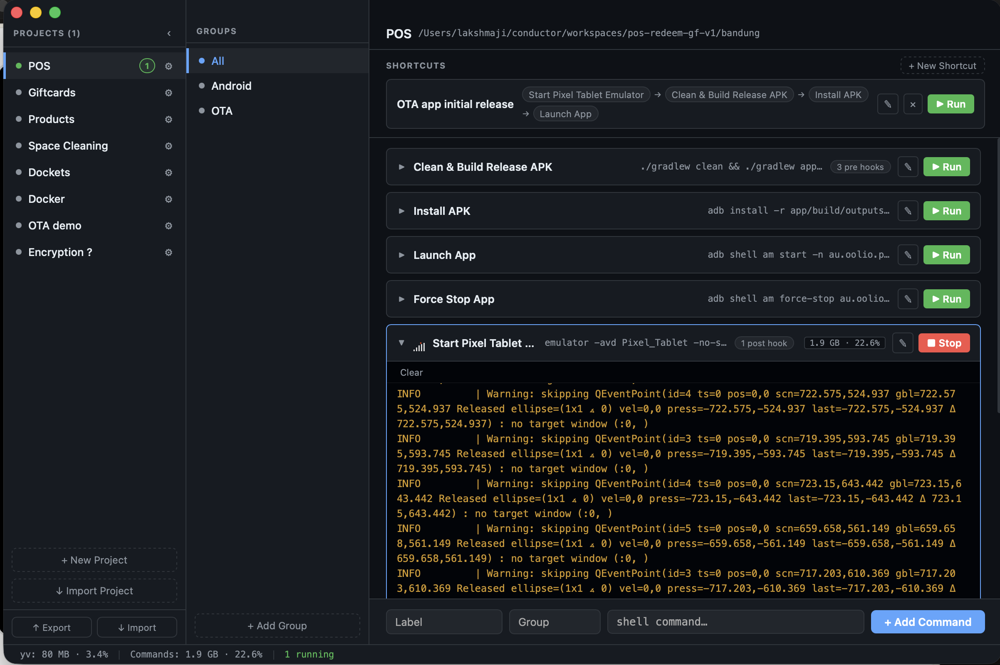
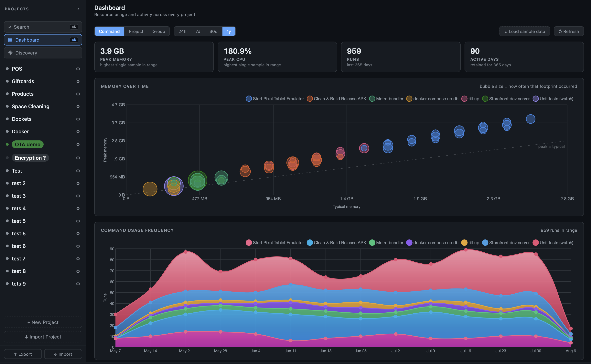

# yv

[](https://github.com/lakshmaji/yv/actions/workflows/build.yml)
[](./LICENSE)


A local dev command runner. Create projects, attach shell commands, and run them with
live streaming output — all from a clean desktop app.

Open source, MIT licensed. If it saves you a few `cd`s a day,
[a star](https://github.com/lakshmaji/yv) helps other developers find it.



---

## Install

Grab the build for your platform from the
[latest release](https://github.com/lakshmaji/yv/releases/latest):

| Platform | Asset |
|---|---|
| macOS (Apple Silicon) | `yv-macos-arm64-*.dmg` |
| Linux (x86_64) | `yv_*.deb`, or `yv-linux-amd64-*.tar.gz` for just the binary |
| Windows (x86_64) | `yv-windows-amd64-*.exe` |

macOS is the primary target and the most exercised; Linux and Windows are built and
released by CI but see less day-to-day use.

### macOS: the first launch

The app is unsigned (no Apple Developer account), so Gatekeeper will say _"cannot be
opened because the developer cannot be verified"_. To open it:

1. Right-click (or Control-click) `yv.app` → **Open**
2. Click **Open** in the dialog

That is a one-time step. Or clear the quarantine flag from Terminal:

```bash
xattr -d com.apple.quarantine /Applications/yv.app
```

### Linux

```bash
sudo apt install ./yv_*.deb
```

---

## Features

**Running commands**

- **Live terminals** — per-command collapsible inline terminals streaming stdout/stderr
- **Pre-hooks** — run setup commands (e.g. `direnv exec .`) before the main command
- **Post-commands** — run cleanup commands after the main command exits, each with its own timeout
- **Interactive mode** — send stdin, Ctrl+C and Ctrl+D to running processes
- **Resource badges** — live CPU and memory usage per running command

**Organising**

- **Projects & groups** — group commands by project and by group (e.g. Android, iOS, Backend), with an optional working directory per group
- **Shortcuts** — named sequences that run several commands in order, stopping at the first failure
- **Environments** — named per-project variable sets (`local`, `staging`, `prod`) injected into every run — [full guide](./docs/environments.md)
- **Spotlight search** (`⌘K`) — find any command in any project by label, shell text, group, project name or hook contents
- **Export / import** — back up or share project configs as JSON or YAML

**Sharing**

- **Nearby devices** — yv finds other yv instances on the local network over mDNS and libp2p
- **Connect by code** — the sending device draws an 8-character code and shows it; only the hash crosses the wire, so the other person has it only because you read it out. Connections last 15 minutes
- **Send projects or files** — one project, your whole config, or arbitrary files (up to 500 MB each, 1 GB and 64 files per transfer) streamed straight to disk with live progress
- **Discovery map** — nearby devices appear as dinosaurs on a procedurally generated island, surveyed by a scanning drone. Optional sounds, entirely from clips you supply

**Insight**

- **Dashboard** (`⌘D`) — peak memory, peak CPU, run counts and an activity heatmap across every project. Collection is **off by default**; turn it on in Settings
- **Settings** (`⌘,`) — your device name, metrics and retention, sounds, drone airframe
- **Keyboard shortcuts** (`⌘/`) — the full list, on a rendered keyboard

---

## Screenshots

**Commands and inline terminals** — the main view: projects on the left, groups in the
middle, commands with their live terminals on the right.


**Dashboard** — peak memory and CPU, run totals, memory footprint over time, and how
often each command actually gets run.



---

## Requirements (for building from source)

- [Go 1.25+](https://go.dev/dl/)
- [Node.js 18+](https://nodejs.org/) (or [Bun](https://bun.sh/))
- [Wails v2](https://wails.io/docs/gettingstarted/installation)

```bash
go install github.com/wailsapp/wails/v2/cmd/wails@latest
```

On Linux, `make deps-linux` installs the system packages Wails needs, and
`make doctor-linux` checks them.

---

## Development

```bash
make run             # start the app in dev mode (hot reload)
make run-linux       # same, with the Linux build tags
make test            # Go tests + frontend tests
make fmt             # format Go sources
```

---

## Building

```bash
make build           # app bundle in build/bin/
make dmg             # macOS: yv.dmg in the project root
make deb             # Linux: a .deb in build/bin/
make install-linux   # Linux: build the .deb and install it
```

The version comes from `productVersion` in `wails.json` — one source of truth for the
bundle, the `.deb` and the release assets. Pushing a `v*` tag makes CI build all three
platforms and publish a GitHub Release.

---

## Configuration

Projects and settings live in your user config directory:

| Platform | Directory |
|---|---|
| macOS | `~/Library/Application Support/yv/` |
| Linux | `$XDG_CONFIG_HOME/yv/` (usually `~/.config/yv/`) |
| Windows | `%AppData%\yv\` |

| File | Holds |
|---|---|
| `projects.json` | projects, groups, commands, shortcuts |
| `settings.json` | app settings |
| `environments.json` | environment variables, **mode 0600** |
| `metrics/` | collected resource samples (only if metrics are enabled) |

`environments.json` is deliberately separate from `projects.json`: Export Project and
Export Projects never include it, so a config you share or commit carries no secrets.

---

## Documentation

- [Environments — per-project variables & secrets](./docs/environments.md)
- `CLAUDE.md` — architecture notes and the reasoning behind most design decisions

---

## Contributing

Issues and pull requests are welcome — [open an issue](https://github.com/lakshmaji/yv/issues)
if something is broken or missing.

**★ If yv is useful to you, please [star the repo](https://github.com/lakshmaji/yv).**
It costs nothing and it is the main way other developers find the project.

More tools are on the way; they will be shared openly here too.

**Open to volunteering.** I'm available to contribute, unpaid, to software and app
development that helps people — non-profits especially. If that's you, get in touch via
[github.com/lakshmaji](https://github.com/lakshmaji).

---

## Tech stack

| Layer | Technology |
|---|---|
| Desktop shell | [Wails v2](https://wails.io/) |
| Backend | Go 1.25 |
| Frontend | SolidJS + TypeScript |
| PTY | [creack/pty](https://github.com/creack/pty) |
| Peer transport | [libp2p](https://libp2p.io/) + mDNS |
| Charts | [Chart.js](https://www.chartjs.org/) |

---

## License

[MIT](./LICENSE) © 2026 Lakshmaji
