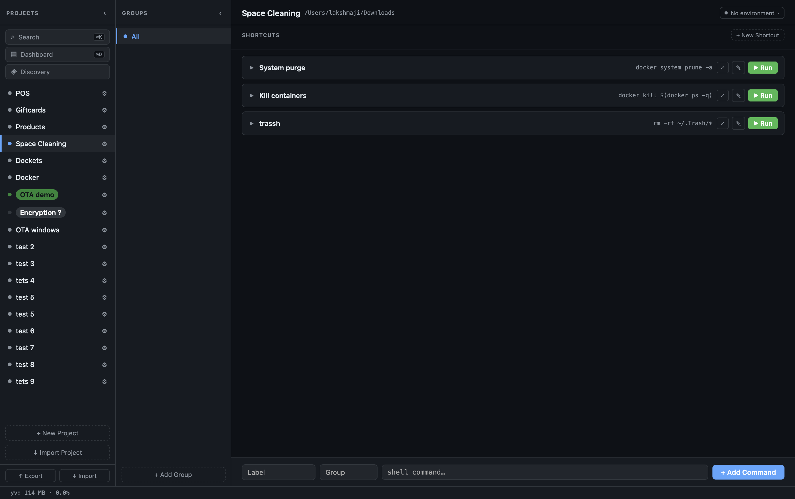
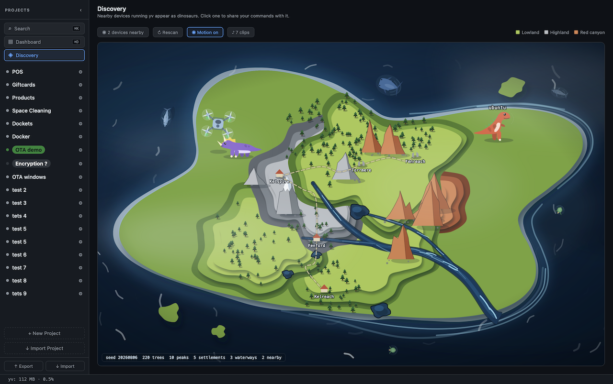
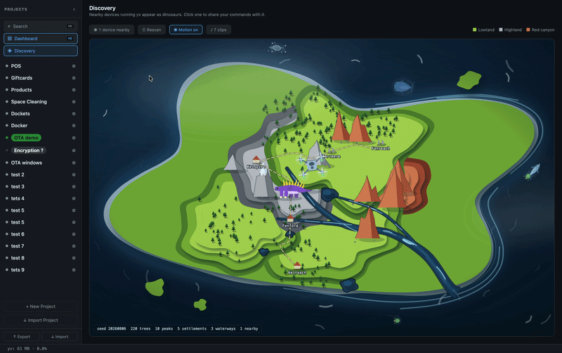

# yv

[](https://github.com/lakshmaji/yv/actions/workflows/build.yml)
[](./LICENSE)
[](https://github.com/sponsors/lakshmaji)

[](https://wails.io/)
[](https://www.solidjs.com/)

**A command runner for developers who work across many projects.**







<video src="https://github.com/user-attachments/assets/b639a1d1-0299-4ee7-bf7a-8ebaadcd517f" controls muted loop width="100%"></video>

<video src="https://github.com/user-attachments/assets/91f946e4-bbb8-41c3-84c2-79434c81ff84" controls muted loop width="100%"></video>


---

## Motivation

We are in the age of AI-assisted development. Developers juggle more projects than ever — multiple repos, multiple stacks, multiple environments — often running several in parallel with help from AI agents and LLM harnesses.

In that context, two things keep slowing people down:

1. **You forget commands.** Not because you are bad at your job — because context switches are constant and the list keeps growing. You end up asking an AI agent or digging through terminal history for `./gradlew app:assembleRelease` or whatever it was.

2. **Sharing a command list takes effort.** You figure out the right sequence, then explain it to a colleague over Slack, or they dig through the wiki. The next time, you do it again.

yv is a **playbook for your shell commands**. Instead of typing them, you click a button. Instead of explaining them, you export and share the project config. Your teammates import it and run the same commands with the same click.

> This tool may not feel necessary if you type fast and keep everything in your head. It is built for the rest of the context.

---

## What it does

- **Click to run** — each project holds a list of shell commands. One click runs any of them, with live output streaming into an inline terminal.
- **Shareable config** — export a project as JSON or YAML and commit it alongside your code. Teammates import it and get the same runbook immediately.
- **Environments** — hook in named variable sets (`local`, `staging`, `prod`) per project. Secrets stay on your machine and never appear in exported config.
- **Peer-to-peer sharing** — send a project config or files directly to another device on the same network. No cloud, no account.
- **Auto-updates** — yv updates itself silently on macOS, Windows, and Linux (AppImage). No manual downloads after the first one.

Project data stays on your machine by default. Peer sharing sends selected data to devices on your local network, and update checks contact GitHub. Nothing is tracked.

---

## Install

Download the latest build from **[github.com/lakshmaji/yv/releases](https://github.com/lakshmaji/yv/releases)**:

| Platform | Asset |
|---|---|
| macOS (Apple Silicon) | `yv-macos-arm64-*.dmg` |
| Windows (x86_64) | `yv-windows-amd64-*-setup.exe` |
| Linux (x86_64) | `yv-linux-x86_64-*.AppImage` (self-updating) |
| Linux (x86_64) | `yv_*.deb` or `yv-linux-amd64-*.tar.gz` |

```bash
# Linux .deb
sudo apt install ./yv_*.deb
```

Every release asset ships with a `.sha256` checksum beside it. To verify a download before installing:

```bash
shasum -a 256 -c yv-macos-arm64-*.dmg.sha256
```

### macOS: first launch

The app is not yet signed (no Apple Developer account — working on it). Gatekeeper will block the first open:

1. Right-click `yv.app` → **Open**
2. Click **Open** in the dialog

Or from Terminal:

```bash
xattr -d com.apple.quarantine /Applications/yv.app
```

One-time step. After that it opens normally.

### Auto-updates

yv checks for updates silently a few seconds after launch. **Help → Check for Updates…** asks on demand. Updates are verified against a key built into your copy before anything is applied.

On Linux, only the **AppImage** self-updates. The `.deb` installs to root-owned `/usr/bin` and has no configured APT repository — to upgrade, download the new `.deb` from the releases page and run `sudo apt install ./yv_*.deb` again.

---

## Learn more

- **[Features & screenshots](./FEATURES.md)** — what the app looks like and what each part does
- **[Development setup](./DEVELOPMENT.md)** — how to build and run locally
- **[Environments guide](./docs/environments.md)** — per-project variables and secrets
- **[Releasing](./RELEASING.md)** — versioning, signing keys, CI pipeline

---

## Contributing

Issues and pull requests are welcome — [open an issue](https://github.com/lakshmaji/yv/issues) if something is broken or missing. See [DEVELOPMENT.md](./DEVELOPMENT.md) to get started.

**If yv is useful to you, [star the repo](https://github.com/lakshmaji/yv).** It helps other developers find it.

---

## Sponsor

yv is free for personal and noncommercial use. If it saves you time — fewer commands forgotten, faster onboarding for new teammates, less back-and-forth explaining runbooks — consider sponsoring.

Your support funds the time and effort it takes to keep improving this tool: new features, bug fixes, and making the daily lives of developers, project managers, and anyone drowning in context switches a little easier.

**[Sponsor on GitHub →](https://github.com/sponsors/lakshmaji)**

---

## License

[MIT](./LICENSE) © 2026 Lakshmaji Mutyala
