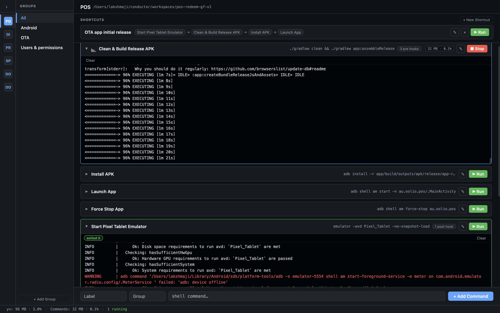

# yv

A local dev command runner for macOS. Create projects, attach shell commands, and run them with live streaming output — all from a clean desktop app.

This is an open source project.


---

## Features

- **Projects & Groups** — organise commands by project and group (e.g. Android, iOS, Backend)
- **Live terminals** — per-command collapsible inline terminals with streaming stdout/stderr
- **Pre-hooks** — run setup commands (e.g. `direnv exec .`) before the main command
- **Post-commands** — run cleanup commands after the main command exits
- **Shortcuts** — named sequences that run multiple commands in order
- **Interactive mode** — send stdin, Ctrl+C, and Ctrl+D to running processes
- **Resource badges** — live CPU and memory usage per running command
- **Environments** — named per-project variable sets (e.g. `local`, `staging`, `prod`) injected into every run
- **Export / Import** — back up or share project configs as JSON or YAML

---




## Requirements

- macOS (ARM64 / Apple Silicon)
- [Go 1.24+](https://go.dev/dl/)
- [Node.js 18+](https://nodejs.org/)
- [Wails v2](https://wails.io/docs/gettingstarted/installation)

Install Wails:

```bash
go install github.com/wailsapp/wails/v2/cmd/wails@latest
```

---

## Development

```bash
make run      # start the app in dev mode (hot reload)
make test     # run all Go unit tests
make fmt      # format Go source files
```

---

## Build a release DMG (no Apple Developer account needed)

### 1. Build the app bundle

```bash
wails build -platform darwin/arm64
```

Output: `build/bin/yv.app`

### 2. Package as a DMG

macOS includes `hdiutil` — no extra tools needed:

```bash
mkdir -p dist
cp -r build/bin/yv.app dist/

hdiutil create \
  -volname "yv" \
  -srcfolder dist \
  -ov \
  -format UDZO \
  yv.dmg
```

This produces `yv.dmg` in the project root.

### 3. Distribute

Share the `.dmg` file directly (GitHub Releases, direct download, etc.).

> **Note for users opening the app for the first time:**
> Because the app is unsigned, macOS Gatekeeper will show _"cannot be opened because the developer cannot be verified"_.
>
> To open it:
> 1. Right-click (or Control-click) `yv.app` → **Open**
> 2. Click **Open** in the dialog
>
> This only needs to be done once. After that, the app opens normally.
>
> Alternatively, remove the quarantine flag from Terminal:
> ```bash
> xattr -d com.apple.quarantine /Applications/yv.app
> ```

---

## Environments (per-project variables & secrets)

Each project can have any number of named environments — `local`, `staging`, `prod` — and
each holds a list of `KEY` / `value` pairs. Exactly one environment is **active** per
project at a time; its variables are injected into every command you run in that project.

Open **Manage environments…** from the environment switcher in the top-right of the project
header to create environments, edit variables, and pick colours for the switcher chip
(handy for making `prod` unmistakable).

### What the variables apply to

When you press **Run** (or run a shortcut), the active environment's variables are injected
into **all three** stages of that command:

| Stage | Gets the variables? |
|---|---|
| Pre-hooks | ✅ yes |
| Main command | ✅ yes |
| Post-commands | ✅ yes |

They all run in the same resolved environment, so a token defined once is visible to a
`direnv`-style pre-hook, the main process, and a cleanup post-command alike.

### Precedence

The environment for a command is built in this order, each layer overriding the previous:

```
os.Environ()  →  login-shell PATH  →  active environment variables
```

So an environment variable named `PATH` **wins** over the login-shell `PATH`. That is
intentional (it lets you pin a toolchain), but it also means you should normally *extend*
rather than replace it — see below.

### Syntax

Keys must be valid shell variable names:

```
[A-Za-z_][A-Za-z0-9_]*
```

`API_TOKEN`, `_internal`, `PORT2` are valid. `2PORT`, `MY-VAR`, `my.var`, and blank keys are
rejected. Duplicate keys within one environment, and duplicate environment names within one
project, are also rejected.

Values are **literal strings** — they are not shell-expanded when injected. Type them raw:

| Key | Value | Result |
|---|---|---|
| `API_URL` | `https://api.staging.example.com` | exactly that string |
| `AWS_PROFILE` | `staging` | exactly that string |
| `GREETING` | `hello world` | no quoting needed — do **not** wrap in `"` unless you want literal quotes |
| `HOME_COPY` | `$HOME/tmp` | the literal text `$HOME/tmp` — **not** expanded |

If you need expansion, do it in the command itself, where a normal shell is running:

```bash
# Command:
echo "$API_URL"                 # expands the injected variable
mkdir -p "$HOME/$SUBDIR"        # expands both
```

To *extend* `PATH` rather than replace it, don't set a `PATH` variable — prepend in a
pre-hook instead:

```bash
# Pre-hook:
export PATH="$PWD/node_modules/.bin:$PATH"
```

(Pre-hooks and the main command share one shell session when no post-commands are
configured, so an `export` in a pre-hook carries into the main command.)

### Example

Project **Storefront**, environment **staging** (active):

| Key | Value | Secret |
|---|---|---|
| `API_URL` | `https://api.staging.example.com` | no |
| `AWS_PROFILE` | `staging` | no |
| `API_TOKEN` | `sk_live_…` | yes |

Command **Deploy**:

- Pre-hook: `aws sts get-caller-identity --profile "$AWS_PROFILE"`
- Command: `npm run deploy -- --api "$API_URL"`
- Post-command: `curl -fsS -H "Authorization: Bearer $API_TOKEN" "$API_URL/health"`

All three see `API_URL`, `AWS_PROFILE`, and `API_TOKEN`. Switching the active environment
to `prod` in the top-right selector re-runs the same command against the prod values — no
edits to the command itself.

### Guidelines

- **Switch, don't duplicate.** Keep one command and swap environments, rather than making
  a `Deploy (staging)` and a `Deploy (prod)` command.
- **Colour-code risky environments.** Give `prod` a red background in the environment
  editor so the active-environment chip is a visible warning.
- **The active environment is read at launch time.** Changing it does not affect commands
  that are already running — restart them to pick up new values.
- **Mark secrets as secret.** Secret rows are masked in the UI with a per-row reveal
  toggle; they are still passed to the process in full.
- **Nothing is saved until you press Save** in the environments modal; Cancel discards.

### Where secrets are stored

```
~/Library/Application Support/yv/environments.json     (mode 0600)
```

This is a **separate file from `projects.json`** on purpose: Export Project / Export
Projects never includes environment variables, so a config you share or commit carries no
secrets. Deleting a project also deletes its environments.

> The file is plaintext JSON readable by your user account — it is protection against
> accidental sharing, not against a compromised machine. Don't store credentials here that
> you wouldn't keep in a local `.env` file.

---

## Config location

Projects are saved at:

```
~/Library/Application Support/yv/projects.json
```

Environments (kept separate so exports never carry secrets):

```
~/Library/Application Support/yv/environments.json
```

---

## Tech stack

| Layer | Technology |
|---|---|
| Desktop shell | [Wails v2](https://wails.io/) |
| Backend | Go 1.24 |
| Frontend | SolidJS + TypeScript |
| PTY | [creack/pty](https://github.com/creack/pty) |

---

## License

MIT
